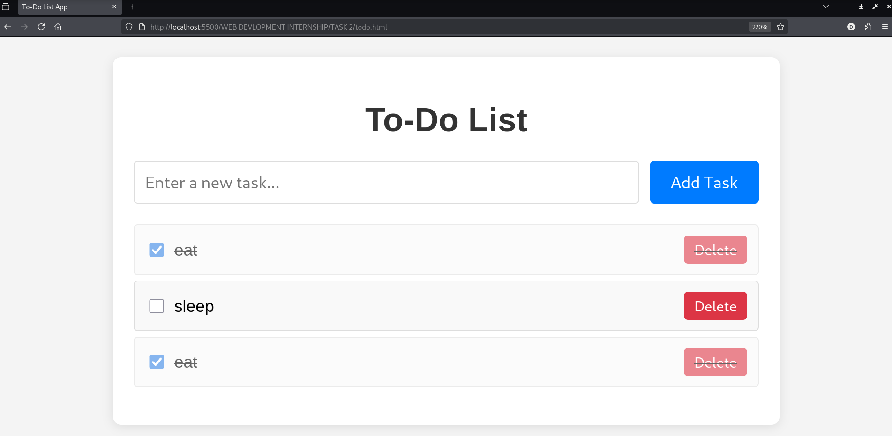

# WEB-DEVELOPMENT INTERNSHIP - Task 2: Build a To-Do List Web App (Front-end only, using Vanilla JavaScript)

## Overview
As part of my JavaScript internship, I completed Task 2 by developing a dynamic front-end to-do list web application using vanilla JavaScript. This task centered on creating an interactive app where users can add, mark as complete, and remove tasks, with real-time UI updates via DOM manipulation. The deliverables are three files—`index.html`, `style.css`, and `script.js`—located in this directory, which together form a fully functional, responsive to-do list without backend dependencies.

This README documents the development process, tools utilized, usage instructions, and key learnings, reflecting my approach as a student interning in web development.

## Screenshots
Below is a screenshot demonstrating the to-do list app in action.

## Features
- **Add Tasks**: Enter text in the input field and click "Add Task" (or press Enter) to dynamically append a new list item.
- **Mark Complete**: Each task includes a checkbox; checking it toggles a "completed" class for visual strikethrough and opacity reduction.
- **Remove Tasks**: A "Delete" button per task removes it from the list instantly.
- **Real-Time Updates**: All interactions update the UI without page reloads, using event-driven JavaScript.
- **User-Friendly Design**: Clean, styled layout with hover effects; input validation prevents empty tasks.

## Tools and Setup
The development environment utilized **Visual Studio Code (VS Code)** for editing, **Google Chrome** for testing and debugging, and the **Live Server** extension for simulating a local server with auto-reload. No frameworks or libraries were used, adhering to vanilla JavaScript principles.

- **Extensions**: Live Server (for instant previews).
- **Prerequisites**: A modern web browser and VS Code installed.

## How to Run the Web App
1. **Prepare the Environment**:
   - Ensure VS Code and Chrome are installed.
   - Place `index.html`, `style.css`, and `script.js` in the same working directory.
2. **Launch in VS Code**:
   - Open VS Code and load the directory containing the files.
   - Install the Live Server extension if not already present (Extensions > Search "Live Server").
3. **Execute and View**:
   - Right-click `index.html` in VS Code and select "Open with Live Server" (or use the "Go Live" button in the status bar).
   - The app will open automatically in Chrome at `http://127.0.0.1:5500/index.html`.
4. **Interact with the App**:
   - Add tasks via input and button/Enter key.
   - Check boxes to mark complete; click Delete to remove.
   - Observe instant UI changes.

**Sample Interaction**: Enter "Learn JS", add it → Checkbox appears → Check to strikethrough → Delete to remove.

If Live Server does not start, ensure port 5500 is available or check VS Code's output panel for errors.

## Development Process
Following the task guidelines, I adopted an iterative approach: structuring HTML, styling with CSS, and enhancing interactivity with JavaScript event handling and DOM methods. The focus was on vanilla JS for core manipulations.

### Step 1: Initial Planning
- Created `index.html`, `style.css`, and `script.js` in VS Code via "New File."
- Added basic HTML structure: Container div, h1, input, button, and empty ul for tasks.

### Step 2: Building the HTML and CSS Layout
- Included input for tasks, add button, and list container in HTML.
- Styled in CSS: Flexbox for input section, borders/shadows for items, hover effects for buttons, and a "completed" class for toggling appearance (strikethrough, opacity).

### Step 3: Implementing JavaScript Functionality
- Used `DOMContentLoaded` to ensure DOM readiness.
- Added event listeners: Click on add button and keypress (Enter) on input.
- In `addTask()`: Validate input, create li/checkbox/span/delete button elements, append to ul, clear input.
- For completion: Checkbox change toggles class on li.
- For removal: Delete button click removes li parent.

### Step 4: Testing Interactivity
- Launched via Live Server and tested in Chrome: Added multiple tasks, marked complete, deleted items.
- Used Chrome DevTools (F12 > Console/Elements) to debug event bindings and DOM changes.
- Verified no page reloads; refined validation for empty inputs.

### Step 5: Refinement
- Ensured mobile-friendly styling with responsive widths.
- Added trim() for clean input handling.

The entire development took approximately one hour, accelerated by Live Server's live reloads.

## Key Learnings
- **DOM Manipulation**: Mastered createElement, appendChild, and classList.toggle for dynamic content insertion and state changes.
- **Event Handling**: Understood addEventListener for buttons, checkboxes, and keypresses, enabling responsive interactions.
- **State Updates**: Learned to manage UI state locally without frameworks, ensuring instant feedback.
- **Vanilla JS Workflow**: Appreciated the power of native APIs over libraries for simple apps; Chrome DevTools proved invaluable for tracing events.
- **Challenges Overcome**: Coordinating multiple elements per task required careful appending order; keypress integration enhanced UX.

This task deepened my proficiency in client-side JavaScript, laying groundwork for more advanced front-end development in the internship.
