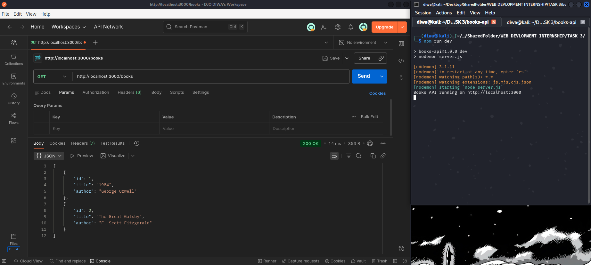
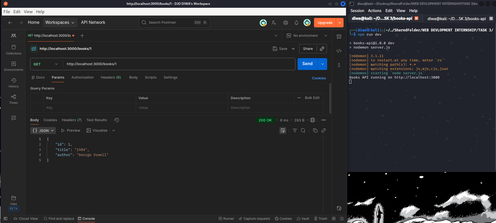
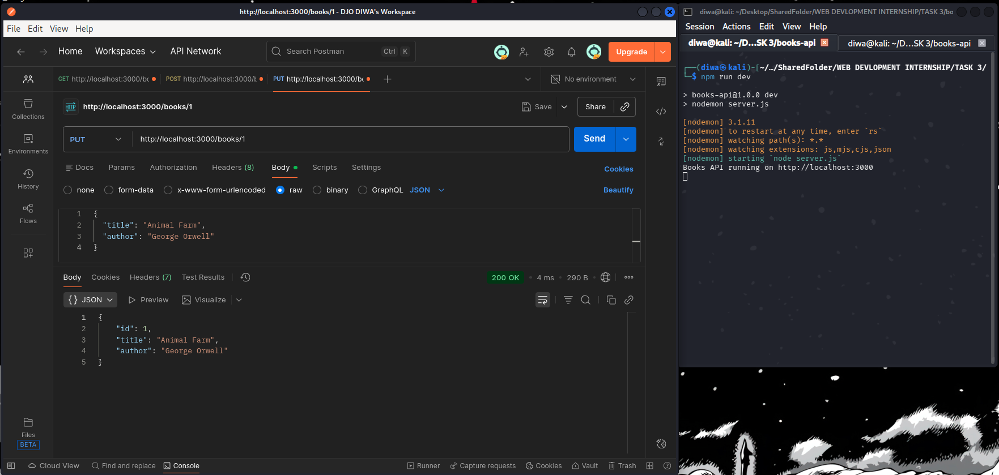
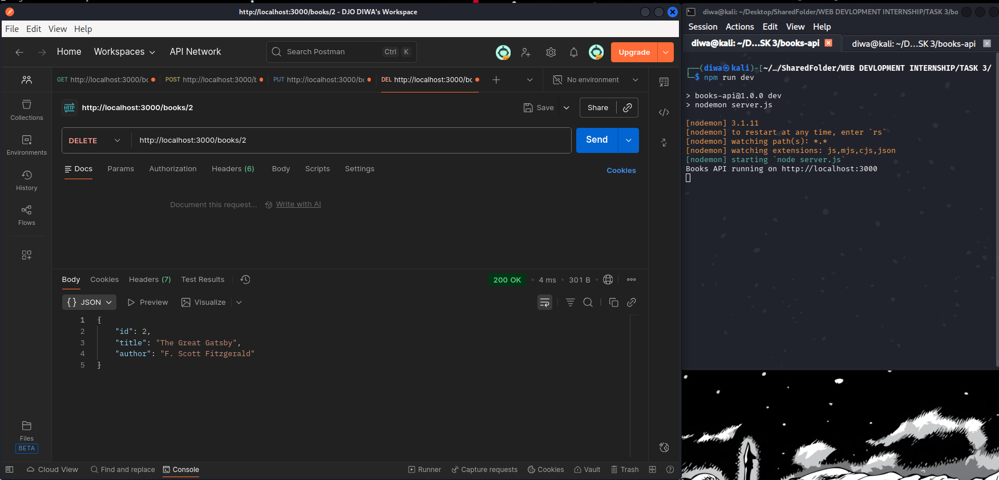
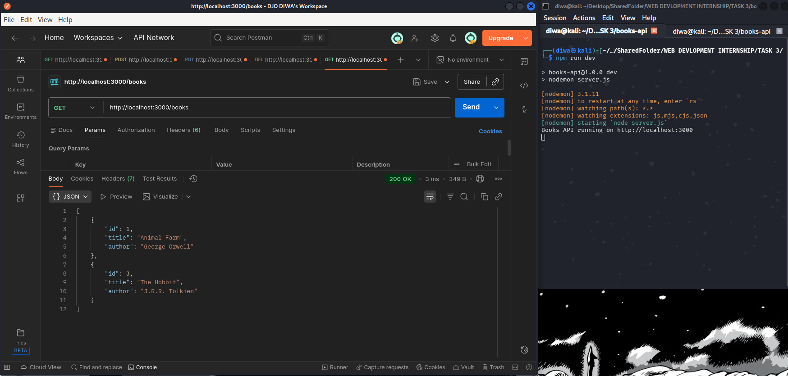

# WEB DEVELOPMENT INTERNSHIP - Task 3: Create a REST API to Manage a List of Books

## Overview
As part of my Node.js internship, I successfully completed **Task 3** by building a fully functional **RESTful API** using **Express.js** that performs complete **CRUD operations** (Create, Read, Update, Delete) on a collection of books.  
The data is stored **in-memory** (no database required) exactly as specified in the task. The API exposes clean, standard endpoints and follows REST conventions properly.

**Deliverables**:
- `server.js` – Main application file
- `package.json` – Project configuration and dependencies

## API Endpoints Summary

| Method | Endpoint          | Description                  | Request Body (JSON)                           | Response                              |
|--------|-------------------|------------------------------|-----------------------------------------------|---------------------------------------|
| GET    | `/books`          | Get all books                | -                                             | 200 + array of books                  |
| GET    | `/books/:id`      | Get a single book by ID      | -                                             | 200 + book object OR 404              |
| POST   | `/books`          | Add a new book               | `{ "title": "...", "author": "..." }`         | 201 + created book                    |
| PUT    | `/books/:id`      | Update an existing book      | `{ "title": "...", "author": "..." }`         | 200 + updated book OR 404/400         |
| DELETE | `/books/:id`      | Delete a book                | -                                             | 200 + deleted book OR 404             |

## Features Implemented
- Auto-incrementing IDs for new books
- Proper HTTP status codes (200, 201, 400, 404)
- Input validation (title & author required)
- JSON request/response handling using `express.json()` middleware
- Clean error messages
- Initial sample data (2 books) so the API works immediately on start

## Tools & Technologies Used
- **Node.js** (v18+)
- **Express.js** – Minimalist web framework
- **Visual Studio Code** – Code editor
- **Postman** – For manual testing of all endpoints
- **nodemon** – Auto-restart server during development (`npm run dev`)

## Project Setup & How to Run (Step-by-Step)
1. Open VS Code → create a new folder → open terminal inside it
2. Initialize project  
   ```bash
   npm init -y
   ```
3. Install dependencies  
   ```bash
   npm install express
   npm install --save-dev nodemon
   ```
4. Create `server.js` and paste the code provided
5. Start the server  
   ```bash
   npm run dev
   ```
   Server will be live at **http://localhost:3000**

## API Testing with Postman – Prompts + Screenshots

### 1. GET /books → Fetch All Books
**Prompt:**  
`GET http://localhost:3000/books`



### 2. GET /books/:id → Fetch One Book
**Prompt:**  
`GET http://localhost:3000/books/1`



### 3. POST /books → Add a New Book
**Prompt:**  
```
POST http://localhost:3000/books
Body → raw → JSON:
{
  "title": "The Lord of the Rings",
  "author": "J.R.R. Tolkien"
}
```


### 4. PUT /books/:id → Update a Book
**Prompt:**  
```
PUT http://localhost:3000/books/1
Body → raw → JSON:
{
  "title": "Nineteen Eighty-Four",
  "author": "George Orwell"
}
```



### 5. DELETE /books/:id → Delete a Book
**Before DELETE (list still contains the book):**  
`GET http://localhost:3000/books`



**After performing DELETE:**  
`DELETE http://localhost:3000/books/3`



All endpoints work perfectly with correct status codes and responses.

## What I Learned from This Task
- Setting up a Node.js + Express project from scratch
- Difference between middleware, routing, and request handling
- REST API design principles and proper HTTP methods/status codes
- Working with `req.body`, `req.params`, and sending JSON responses
- Dynamic routing with `:id` and parsing integers safely
- In-memory data persistence using arrays and `findIndex`
- Auto-incrementing IDs without a database
- Thorough API testing using Postman
- Using `nodemon` for rapid development

This task gave me a rock-solid foundation in backend development with Node.js and Express, and I’m now fully prepared for integrating real databases in upcoming tasks.

Thank you for the opportunity!
