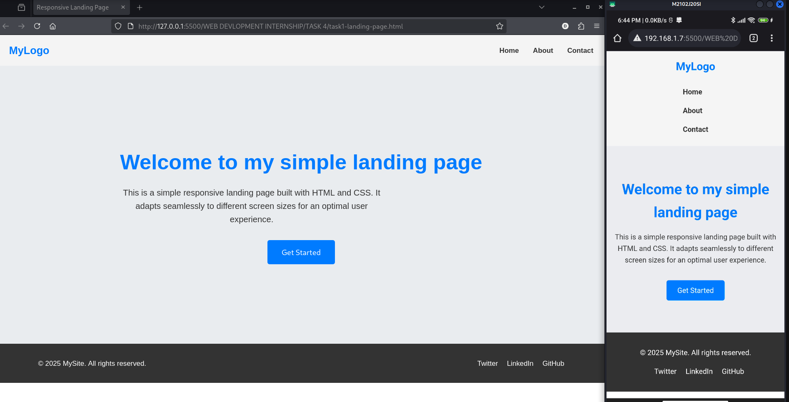
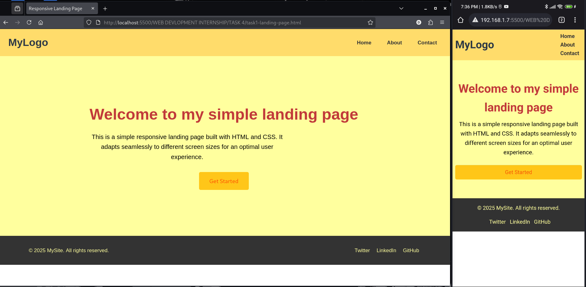

# WEB DEVELOPMENT INTERNSHIP - Task 4: Make a Website Mobile-Friendly Using CSS Media Queries

## Overview
In my web development internship, Task 4 focused on converting the landing page from Task 1 into a fully responsive, mobile-friendly site via CSS media queries. I applied mobile-first design setting base styles for small screens (e.g., vertical nav/footer stacking, smaller fonts/paddings) and using breakpoints to expand for larger devices while fixing overflows and ensuring element scalability. Reusing task1-landing-page.html unchanged, I updated only style.css per the task guidelines. Post-implementation, I customized colors (e.g., hsl(46, 100%, 71%) header, #ffff9e hero) for a warmer aesthetic without impacting functionality.

## Screenshots
Below are screenshots showing the before and after (responsive) previews. Each includes side-by-side desktop and Android (mobile) views captured via Scrcpy.

  
*Original version.*

  
*Updated version.*

## Features
- **Mobile-First Layout**: Base styles optimized for small screens (e.g., vertical nav/footer stacking, reduced paddings/fonts) with media queries overriding for larger devices.
- **Responsive Navigation**: Collapses to a vertical stack on mobile for easy tapping; expands horizontally on desktop.
- **Scalable Hero Section**: Shorter height (50vh mobile → 70vh desktop), centered text with font sizes from 1.8rem to 3rem, and full-width paragraphs.
- **Touch-Friendly Elements**: Button full-width on small screens; padding ensures 44px+ touch targets.
- **Overflow Prevention**: No horizontal scrolling; elements fit cleanly within viewports.
- **Custom Styling**: Warm color palette (e.g., #ffa200 hover links, #ffc619 buttons) for visual appeal, with smooth transitions.
- **Cross-Device Compatibility**: Tested on Android/mobile viewports; flexible units (rem) ensure adaptability.

## Tools and Setup
The development relied on **Visual Studio Code (VS Code)** for editing, **Google Chrome** for desktop previews, and my **Android phone** for real-device mobile testing. No external libraries were needed, keeping it pure CSS on top of the Task 1 HTML.

- **Extensions**: Live Server (for auto-reloading during tweaks).
- **Prerequisites**: VS Code, Chrome, and the Task 1 files (`task1-landing-page.html` and original `style.css`).

## How to Run the Web App
1. **Prepare the Environment**:
   - Install VS Code and Chrome if not already done.
   - Place `task1-landing-page.html` and the updated `style.css` in the same directory.
2. **Launch in VS Code**:
   - Open VS Code and load the project directory.
   - Install/enable the Live Server extension (Extensions panel > Search "Live Server").
3. **Execute and View**:
   - Right-click `task1-landing-page.html` and select "Open with Live Server" (or click "Go Live" in the status bar).
   - The page opens in Chrome at `http://127.0.0.1:5500/task1-landing-page.html`.
4. **Test Responsiveness**:
   - On desktop: Resize the Chrome window to <768px to simulate mobile.
   - On phone: Open the Live Server URL in your mobile browser to view real-device rendering; take screenshots for comparison.
   - Interact: Hover links/buttons; confirm clean fit on small screens.
**Sample Interaction**: On mobile, nav items stack under the logo; resize browser—layout fluidly shifts to horizontal.

If Live Server fails, check port 5500 availability or VS Code's Output panel.

## Development Process
Guided by the task hints, I iterated on the Task 1 landing page in VS Code, focusing on CSS-only changes for a mobile-first refactor. The process emphasized testing at each step to catch issues early.

### Step 1: Open the HTML Page in VS Code
- Loaded `task1-landing-page.html` and original `style.css`.
- Reviewed structure: Flexbox-based header/hero/footer great for responsiveness, but desktop-biased (e.g., large fonts, row layouts).

### Step 2: Identify Fixed Width Elements or Large Images
- Scanned for issues: Implicit fixes like `max-width: 600px` on paragraphs and 3rem h1 could overflow on mobile.
- Noted: Flex items assumed horizontal space, risking squeezes.

### Step 3: Write Media Queries Targeting Max-Width 768px
- Shifted to mobile-first: Set base styles for <769px (vertical stacks, small fonts).
- Added `@media (max-width: 768px)` for tablet tweaks and `@media (min-width: 769px)` for desktop expansions.
- Included original `@media (max-width: 480px)` with enhancements.

### Step 4: Adjust Layout—Stack Columns Vertically, Reduce Font Sizes
- Defaulted flex to `column` for nav/footer; scaled hero to 50vh with 1rem padding.
- Fonts: h1 1.8rem base → 3rem desktop; p 1rem → 1.2rem.
- Added custom colors (e.g., #c13a3a for h1) for branding.

### Step 5: Make Nav Menu Collapse or Stack Vertically
- Nav `ul` to `column` base with 0rem margins and 0.5rem link padding for touch.
- Desktop query: Switches to `row` with 2rem spacing.
- Hover: Updated to #ffa200 for consistency.

### Step 6: Test with Phone
- Used Live Server for hot-reloads; opened the URL on my Android phone to view real-device rendering.
- Verified: Stacking at 768px equivalents, no overflows; took screenshots and transferred to desktop for side-by-side comparison.
- Custom tweak: Adjusted logo to 2.0rem for better mobile visibility.

### Step 7: Fix Overflow Issues
- Added `overflow-x: hidden` to body.
- Tightened margins (e.g., nav li: 0rem) and used relative rem units.
- Confirmed: Elements fit cleanly across devices.

The process took about 45 minutes, with phone testing accelerating iterations. Post-task, I refined colors (e.g., footer text #ffff9e) for a cohesive look.

## Key Learnings
- **Media Queries & Mobile-First**: Grasped breakpoints (768px/480px) and base as-mobile strategy reduces code and boosts performance over desktop-first.
- **Flexible Layouts**: Flexbox `direction` toggles enable easy stacking; relative units (rem) make scaling intuitive.
- **Real-Device Testing**: Phone previews revealed nuances like touch sizing that simulations miss screenshots helped document changes quickly.
- **Customization Balance**: Adding personal colors (e.g., #65270b hover) enhanced UX without breaking responsiveness.
- **Challenges Overcome**: Ensuring desktop "reverts" perfectly to Task 1 feel required precise query targeting; overflow fixes were subtle but critical.
This task built my confidence in responsive CSS, bridging Task 1's static page to dynamic, device-agnostic design key for modern web dev.

## Files Included
- `task1-landing-page.html` (unchanged from Task 1)
- `style.css` (fully updated responsive version with custom colors).

