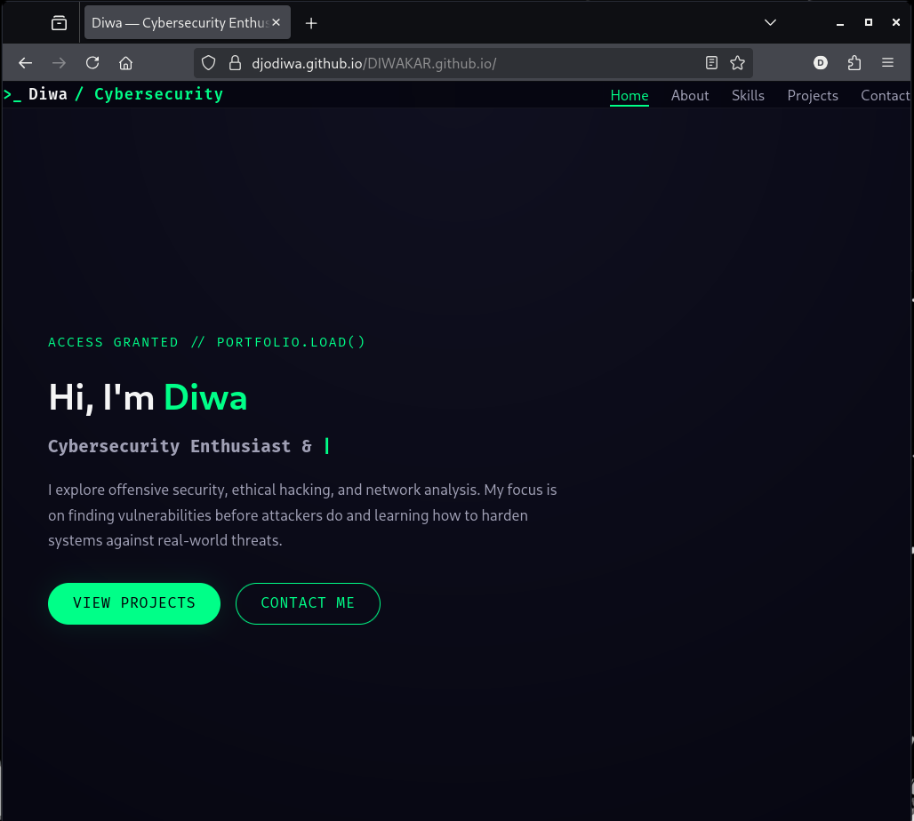

# WEB DEVELOPMENT INTERNSHIP - Task 5: Deploy a Static Website Using GitHub Pages

## Overview
Task 5 required deploying a fully functional static website for free using **GitHub Pages**. I successfully hosted my personal portfolio/static site without any third-party tools or paid hosting. The site is now live and publicly accessible at:

**Live Website URL:** https://djodiwa.github.io/DIWAKAR.github.io/

This demonstrates complete understanding of version control workflow, GitHub repository management, and GitHub Pages deployment.

## Live Site Screenshot
  
*Full screenshot of the deployed website running on GitHub Pages (https://djodiwa.github.io/DIWAKAR.github.io/)*

## Deployment Steps Followed
1. **Created a GitHub Repository**  
   Repository name: `DIWAKAR.github.io` (username.github.io format for personal site)

2. **Prepared Static Website Files**  
   - `index.html` (main page)
   - `style.css` (styling)
   - `script.js` (if any interactivity)
   - Images and assets in proper folders

3. **Uploaded Files Directly via GitHub Web Interface**  
   - Used GitHub's web editor (no local Git required)
   - Clicked "Add file" → "Upload files"
   - Dragged and dropped all website files including `index.html` at the root

4. **Enabled GitHub Pages**
   - Went to repository → **Settings** → **Pages**
   - Under "Source": Selected **Deploy from a branch**
   - Branch: `main`  
   - Folder: `/ (root)`
   - Clicked **Save**

5. **Waited for Deployment**  
   GitHub automatically built and published the site within 1–2 minutes

6. **Site Went Live!**  
   Accessible at: https://djodiwa.github.io/DIWAKAR.github.io/

## Features of This Deployment
- 100% free hosting
- Automatic HTTPS (SSL certificate by GitHub)
- Fast global CDN delivery
- Instant updates on every commit/push
- Custom domain ready (can add later)
- Version control with full Git history

## Future Updates
Any change to the site is now as simple as:
- Editing files directly on GitHub → Commit → Site updates automatically in seconds

## Tools Used
- GitHub Account
- GitHub Web Interface (no local installation needed)
- Browser only

## Key Learnings
- How GitHub Pages turns any repository into a live website
- Importance of correct repository naming (`username.github.io`) for personal sites
- Difference between project sites and user/organization sites
- Zero-cost professional web hosting workflow
- Clean deployment pipeline using only browser
