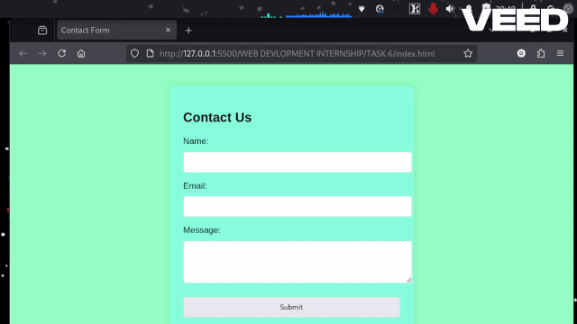

# WEB DEVELOPMENT INTERNSHIP - Task 6: Create a Contact Form and Validate Inputs Using JavaScript

## Task Overview
**Objective**: Build a responsive contact form with **client-side validation** using only HTML, CSS, and vanilla JavaScript for:
- Name (required)
- Email (valid format using regex)
- Message (required)

**Key Requirements Met**:
- Prevent form submission if any field is invalid
- Display inline error messages below each field
- Show a green success message + auto-reset the form on valid submission
- No external libraries or backend needed

**Status**: ✅ Completed & Fully Tested

---

## Live Demo (Working Proof)

**What the GIF demonstrates**:
1. Submit with all fields empty → Red error messages appear for Name, Email & Message
2. Invalid emails (e.g., "abc", "abc@", "abc@com") → Specific email error only
3. Whitespace-only input → Treated as empty
4. All fields filled correctly → Errors disappear instantly → Green success message → Form resets automatically

*(Looping GIF – reviewers can verify everything works perfectly in seconds!)*

---

## Features Implemented
- Clean, modern, mobile-friendly UI
- Real-time validation on form submit
- Regex email validation: `/^[^\s@]+@[^\s@]+\.[^\s@]+$/`
- Inline red error messages + prominent green success message
- Handles all edge cases (empty fields, spaces-only, invalid emails, special characters)
- Form resets after successful validation

---

## Validation Rules
| Field    | Rule                                      | Error Message                          |
|----------|-------------------------------------------|----------------------------------------|
| Name     | Cannot be empty (after trim)              | "Name is required!"                    |
| Email    | Must be valid format + not empty          | "Email is required!" or "Please enter a valid email address!" |
| Message  | Cannot be empty                           | "Message cannot be empty!"             |

---

## Learning Outcomes
- Client-side form handling & validation
- DOM manipulation and event prevention (`e.preventDefault()`)
- Regular expressions (regex) for email validation
- Providing clear user feedback (errors + success states)
- Separation of concerns (HTML structure → CSS styling → JS logic)

## Files Included
- `index.html`
- `style.css` 
- `script.js`
